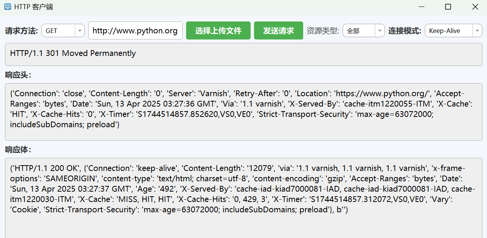
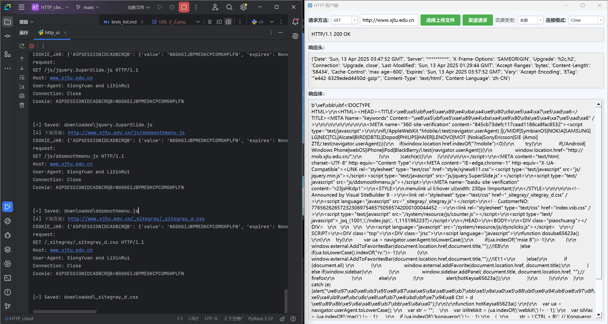

# 计算机网络专题实验 · 实验八报告

| 姓名   | 班级         |
|--------|--------------|
| 熊原   | 计算机2201   |
| 李鑫瑞 | 计算机2204   |

---

## 一、实验名称

### 基于 **HTTP** 协议的客户端程序（文本浏览器）

---

## 二、测试内容

### 1. GET 请求测试

> 使用常规 GET 请求测试客户端的请求与响应功能。

---

### 2. HEAD 请求测试

> 验证是否能仅请求响应头部信息，无响应体内容。

---

### 3. POST 请求测试

> 包括文件上传、多字段提交等 POST 操作，验证参数解析和服务器响应情况。

---

### 4. URL 解析功能测试

> 正确处理包含特殊字符的 URL 编码。

- 示例 URL：
  - `https://www.w3schools.com/~username/`
  - `https://www.w3schools.com/%7Eusername/`
  
  
  

---

### 5. 应答码测试

> 验证不同状态码的处理能力。

- 500 错误码：[https://httpstat.us/500](https://httpstat.us/500)

- 3xx 重定向：[https://www.python.org](https://www.python.org)

---

### 6. 连接模式测试

> 支持 Keep-Alive 与 Close 模式。

---

### 7. HTTPS 支持测试

> 检查是否能通过 TLS 访问 HTTPS 网站。

- 示例网站：[https://www.python.org](https://www.python.org)

---

### 8. 重定向处理测试

> 客户端能否自动跳转到目标地址。

---

### 9. Chunked 传输测试

> 使用 chunked 分块传输响应的测试。

- 测试脚本：`test_chunked.py`

---

### 10. Gzip 解码测试

> 是否能够自动识别并解码 gzip 编码的响应体。

- 测试脚本：`test_gzip.py`

---

### 11. Cookie 机制测试

> 验证客户端是否能正确处理和发送 Cookie。

- 测试脚本：`test_cookie.py`

---

### 12. 缓存机制测试

> 检查 Last-Modified 与 ETag 缓存策略的支持。

- 连续访问同一页面两次，查看是否使用缓存。

---

### 13. 文件上传测试（POST）

> 通过 POST 方法上传本地文件。

- 测试服务器：[http://47.109.192.71:8080](http://47.109.192.71:8080)

### 14. 不同类型的文件获取：
- img：

- script:

- link:

- pdf:

