# 计算机网络专题实验 · 实验八自测报告

| 姓名   | 班级         |
|--------|--------------|
| 熊原   | 计算机2201   |
| 李鑫瑞 | 计算机2204   |

---

## 一、实验名称

### 基于 **HTTP** 协议的客户端程序（文本浏览器）

---

## 二、测试内容

### 1. GET 请求测试

> 使用常规 GET 请求测试客户端的请求与响应功能。
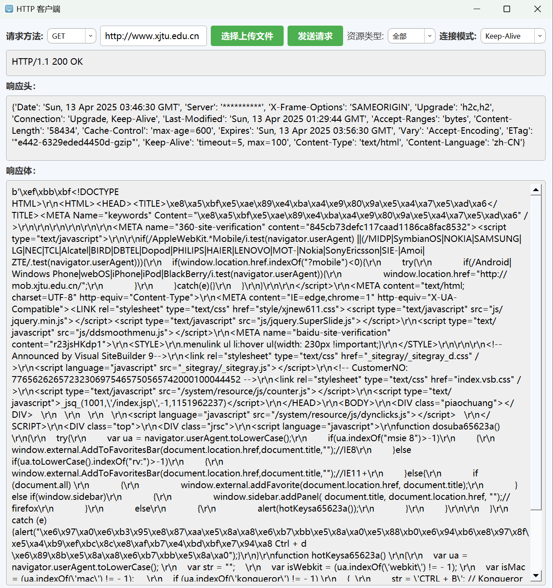
> 如图，访问了学校网页，成功返回了对应的响应头和响应体
---

### 2. HEAD 请求测试

> 验证是否能仅请求响应头部信息，无响应体内容。
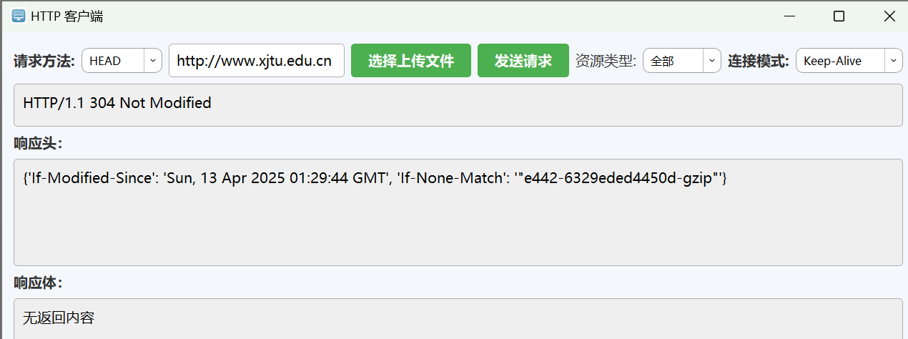
> 如图，使用HEAD时，由于之前已经访问过了对应的网站，此时再次使用HEAD访问时，会触发缓存，但是HEAD的使用没有问题。
---

### 3. POST 请求测试

> 包括文件上传、多字段提交等 POST 操作，验证参数解析和服务器响应情况。

> 如图，使用阿里云服务器，通过编写python代码搭建简易的服务器，通过客户端发送POST请求，选择上传本地的client.py文件，通过响应体可见POST请求使用正常。
---

### 4. URL 解析功能测试

> 正确处理包含特殊字符的 URL 编码。

- 示例 URL：
  - `https://www.w3schools.com/~username/`
  - `https://www.w3schools.com/%7Eusername/`
  
  
  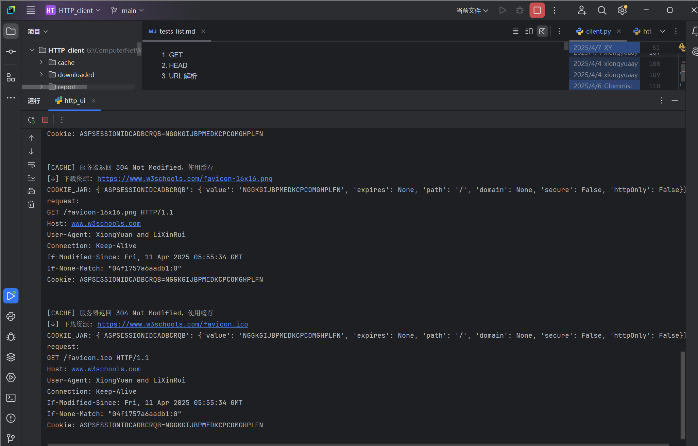

> 如图可见，通过两种不同的URL进行访问，获得了同样的返回内容，说明客户端可以成功解析这两种URL。此处的404状态值是由于网页请求资源本身不存在所导致的，但访问的页面是同一个。

---

### 5. 应答码测试

> 验证不同状态码的处理能力。

- 500 错误码：[https://httpstat.us/500](https://httpstat.us/500)
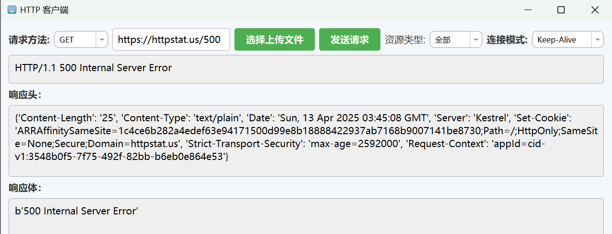
- 3xx 重定向：[https://www.python.org](https://www.python.org)

> 如图，客户端对不同的返回值可以正确的返回结果。对于500，会显示出错误代码。对于301，会自动重定向，最终成功访问目标网站。

---

### 6. 连接模式测试

> 支持 Keep-Alive 与 Close 模式。

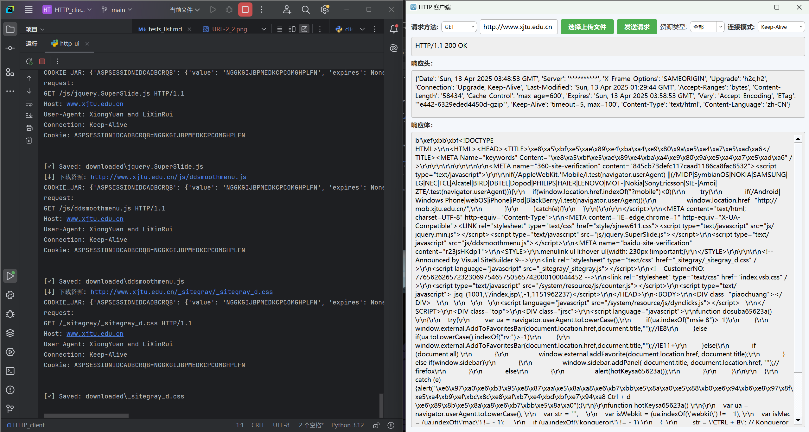

> 如图，这两种连接模式都能够正常使用。
---

### 7. HTTPS 支持测试

> 检查是否能通过 TLS 访问 HTTPS 网站。

- 示例网站：[https://www.python.org](https://www.python.org)

> 如图可见，对于https的网址，该客户端程序仍然成功的返回了正确的响应内容，状态码为200。
---

### 8. 重定向处理测试

> 客户端能否自动跳转到目标地址。

> 如图，对于网址http://www.python.org，返回码是301，在客户端中成功通过重定向，得到了正确的URL，并返回了正确值。

---

### 9. Chunked 传输测试

> 使用 chunked 分块传输响应的测试。

- 测试脚本：`test_chunked.py`
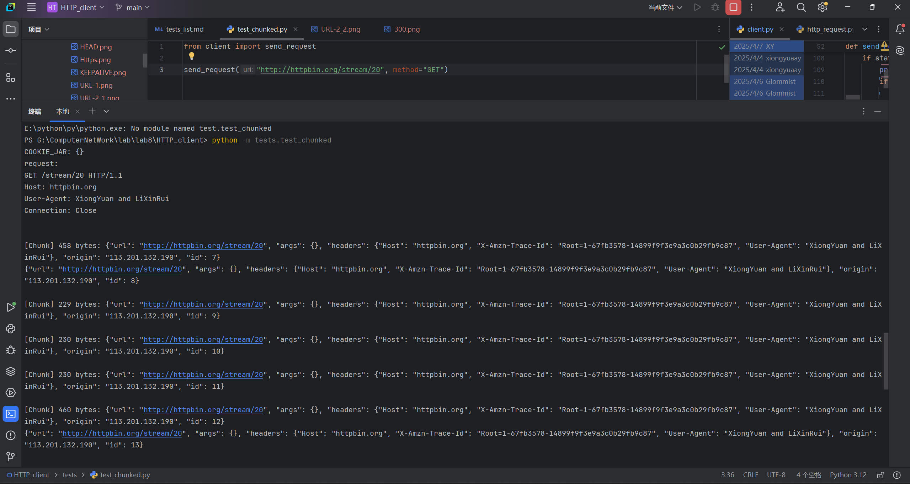

> 如图，成功实现了chunked 分块传输。

---

### 10. Gzip 解码测试

> 是否能够自动识别并解码 gzip 编码的响应体。

- 测试脚本：`test_gzip.py`
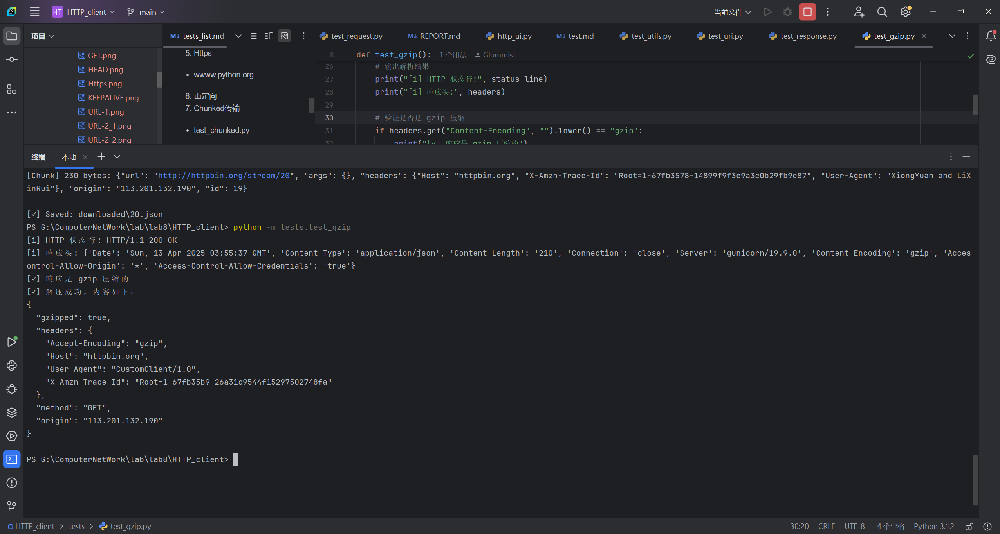

> 如图，成功使用gzip编码，并解码得到了正确的响应内容。

---

### 11. Cookie 机制测试

> 验证客户端是否能正确处理和发送 Cookie。

- 测试脚本：`test_cookie.py`

> 如图，第一次通过访问http://httpbin.org/cookies/set?session_id=123456，设置了session_id，第二次通过http://httpbin.org/cookies访问对应网址，并成功打印出上一次访问时所存储的cookie值。
---

### 12. 缓存机制测试

> 检查 Last-Modified 与 ETag 缓存策略的支持。

- 连续访问同一页面两次，查看是否使用缓存。
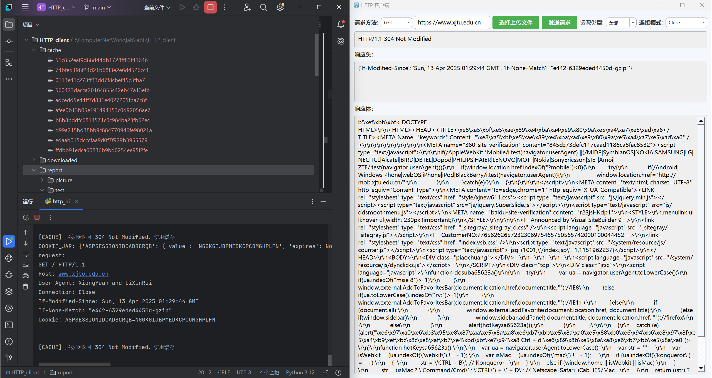

> 如图，在之前已经访问过一次学校网站后再次访问，会返回304，并通过本地存储的资源直接返回。
---

### 13. 文件上传测试（POST）

> 通过 POST 方法上传本地文件。

- 测试服务器：[http://47.109.192.71:8080](http://47.109.192.71:8080)

服务器上传前，内容如下：

此时，uploads文件夹为空。

运行POST，选择文件进行上传，由返回内容可见上传成功。

上传文件后，内容如下：
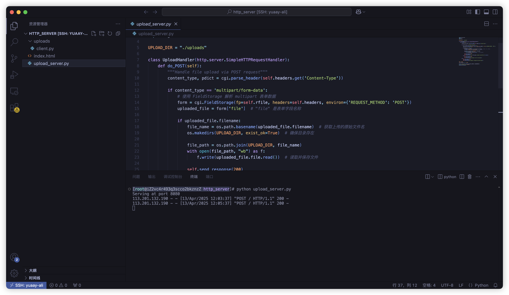
如图，在对应的服务器中，也出现了被上传的文件。

### 14. 不同类型的文件获取：
- img：
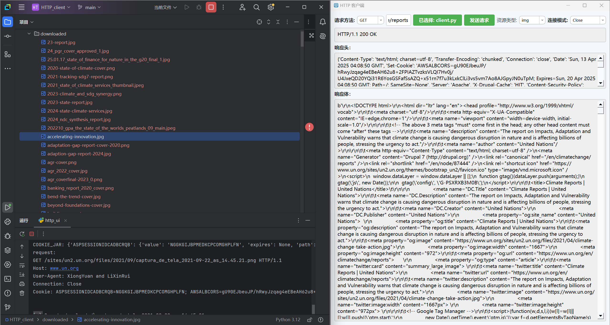
- script:

- pdf:
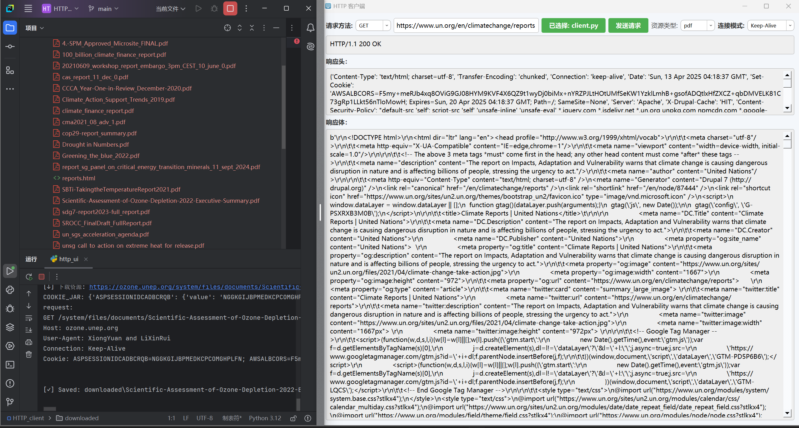

> 如图，访问网址后，通过资源类型选择下载资源文件，可以在对应的download文件夹得到该种类型的文件。
